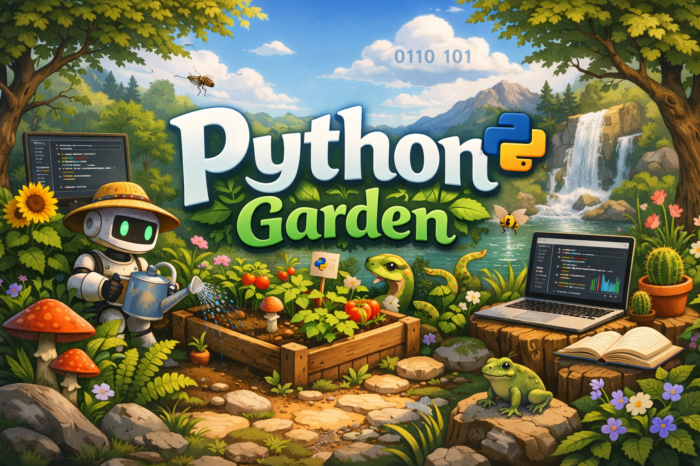
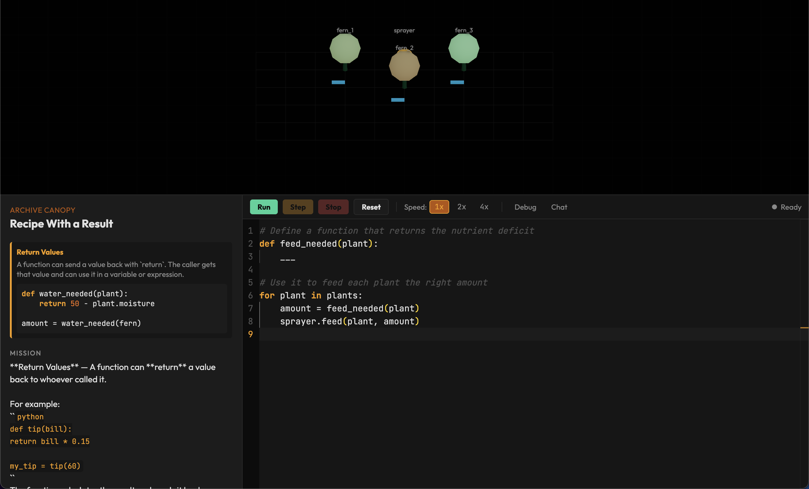

# PythonGarden

A browser-based educational game that teaches beginner-to-intermediate Python through ecosystem restoration puzzles. Players write real Python code to control irrigation systems, drones, and environmental tools — bringing a failing alien biosphere back to life.

> **Programming concepts stick better when code visibly changes a living world.**





## What It Does

PythonGarden embeds Python fundamentals into a cozy simulation game. Instead of abstract coding drills, players write short programs that produce immediate, visible results in a 3D garden world.

**Variables** become world state. **Conditionals** become routing logic. **Loops** become automation. **Functions** become reusable behaviors. **Data structures** become species registries and care plans.

### Curriculum (50 Levels)

| Act | Levels | Biome | Concepts |
|-----|--------|-------|----------|
| 1 | 1-4 | Silent Greenhouse | Commands, variables |
| 2 | 5-8 | Thirst Fields | Strings, if/else |
| 3 | 9-11 | Pollinator Ridge | For loops, nested if |
| 4 | 12-14 | Root Network | While loops, functions |
| 5 | 15-20 | Archive Canopy / Memory Marsh / Crystal Summit | Return values, lists, dicts, boolean operators, capstone |
| 6 | 21-25 | Shifting Delta | Elif, in operator, modulo |
| 7 | 26-30 | Ember Terraces | Range, break, continue |
| 8 | 31-35 | Echo Ravine | F-strings, string methods, type conversion |
| 9 | 36-41 | Tide Pools | Enumerate, zip, slicing, list comprehensions, nested dicts |
| 10 | 42-47 | Aurora Steppe | Sorted with key, aggregation, default params, tuple unpacking, nested loops |
| 11 | 48-50 | Genesis Crater | Accumulator pattern, complex algorithms, milestone integration |

Scaffolding progressively reduces — early levels are fill-in-the-blank, later levels provide only a mission brief and the student writes everything from scratch.

## Tech Stack

| Layer | Technology |
|-------|-----------|
| UI Framework | React 19 + TypeScript |
| Build Tool | Vite 6 |
| Python Runtime | Pyodide (CPython compiled to WebAssembly) |
| Code Editor | Monaco Editor |
| 3D Rendering | Three.js |
| State Management | Zustand 5 + Immer |
| Styling | Tailwind CSS 4 |
| Desktop (optional) | Electron |

## Architecture

```
Player writes Python  -->  Pyodide Web Worker  -->  GameAction queue
                                                         |
                                                         v
        React UI  <--  Zustand Store  <--  SimulationEngine applies actions
            |
            v
       Three.js WorldView renders updated state
```

**4 decoupled layers:**

1. **UI Layer** — React components (Monaco editor, mission panel, debug tools, 3D world view)
2. **Game Runtime** — Level management, validation engine with pluggable conditions (state, action, concept, resource)
3. **Python Sandbox** — Pyodide running in a Web Worker with SharedArrayBuffer for interrupt/step signaling. 8-layer security: restricted builtins, `__slots__` on stubs, collection caps, name validation, pre-execution scanning
4. **Simulation Engine** — Processes action queues, updates world state immutably via Immer, validates success conditions

### Key Design Decisions

- **Stub objects pattern**: Python API calls record `GameAction` objects instead of making cross-thread calls. The main thread applies them to world state after execution completes.
- **State mirroring**: Stubs mirror state changes locally (e.g., `water()` updates `plant.moisture` in the stub) so `while` loop conditions can terminate correctly without cross-thread communication.
- **Concept detection**: Regex-based pattern matching on student code with comment stripping to verify concept usage (e.g., detecting `elif`, `enumerate()`, list comprehensions).
- **Progressive scaffolding**: Starter code reduces from fill-in-the-blank to mission-brief-only across 50 levels. Solutions live exclusively in the hint system's third tier (`structuralHelp`).

## Project Structure

```
codegarden/
  src/
    components/       # React UI components
      CodeEditor/     #   Monaco editor wrapper
      WorldView/      #   Three.js 3D scene + entity renderers
      MissionPanel/   #   Level description + concept cards
      DebugPanel/     #   Variable inspector + execution trace
      ChatPanel/      #   AI tutor (OpenAI-powered)
      HintPanel/      #   3-tier progressive hint system
      SuccessOverlay/ #   Level completion modal
      Toolbar/        #   Run/Step/Stop/Reset controls
    data/
      levels/         # 50 level definitions (TypeScript data)
      concepts/       # 31 concept card definitions
      errors/         # Friendly error message rules
    engine/
      simulation/     # Action applicator + entity logic
      validation/     # Success condition checkers (state, action, concept, resource)
      runtime/        # Execution controller
      levels/         # Level manager + registry
    sandbox/
      worker/         # Pyodide Web Worker + Python bootstrap
      errorRules/     # Levenshtein fuzzy-matched error suggestions
    store/            # Zustand slices (game, execution, progress)
    hooks/            # React hooks (execution controller, level loader)
    pages/            # Route pages (MainMenu, LevelSelect, GameView, Settings)
    types/            # TypeScript interfaces (entities, actions, levels, execution)
    services/         # External API clients (OpenAI)
    styles/           # Global CSS + theme definitions
    utils/            # Shared utilities (Python syntax highlighter)
  public/             # Static assets (favicon, icons)
  electron/           # Electron desktop wrapper (optional)
```

## Getting Started

### Prerequisites

- **Node.js** >= 18
- **npm** (included with Node)

### Install and Run

```bash
# Clone the repository
git clone https://github.com/scalinity/PythonGarden.git
cd PythonGarden/codegarden

# Install dependencies
npm install

# Start the development server
npm run dev
```

Open [http://localhost:5173](http://localhost:5173) in your browser.

### Build for Production

```bash
npm run build
npm run preview   # Preview the production build locally
```

### Desktop App (Electron)

```bash
npm run electron:dev   # Starts Vite + Electron concurrently
```

### Lint

```bash
npm run lint
```

## Game API

Players interact with the garden through Python stub objects. Each level exposes a subset of these:

### Entities

| Object | Key Properties | Key Methods |
|--------|---------------|-------------|
| `plant` | `.moisture`, `.health`, `.species`, `.ripe`, `.needs_pollination` | (read-only) |
| `sprinkler` | `.isOn` | `.on()`, `.off()`, `.water(plant)`, `.spray(amount)` |
| `drone` | — | `.move_to(target)`, `.harvest(plant)`, `.pollinate(flower)` |
| `sprayer` | — | `.feed(plant, amount)` |
| `pump` | — | `.transfer(reservoir)` |
| `reservoir` | `.level`, `.max_level` | (read-only) |
| `storage` | `.items` | `.store(item)`, `.store_in(bin, item)` |
| `canopy` | `.isOpen` | `.open()`, `.close()` |
| `weather` | `.sunlight`, `.temperature` | (read-only) |
| `greenhouse` | — | `.row(name)` |

### Available Python Builtins

`print`, `range`, `len`, `int`, `float`, `str`, `bool`, `list`, `dict`, `tuple`, `set`, `enumerate`, `zip`, `map`, `filter`, `sorted`, `reversed`, `min`, `max`, `sum`, `abs`, `round`, `isinstance`

## Validation System

Each level defines success conditions using 4 pluggable condition types:

- **State** — Check entity property values after execution (`plant.moisture >= 50`)
- **Action** — Verify specific actions were performed (`drone_harvest` on target)
- **Concept** — Regex detection of Python patterns in student code (`elif`, `enumerate()`, list comprehensions), with comment stripping to prevent bypass
- **Resource** — Enforce action efficiency limits (`maxActions: 5`)

## Sandbox Security

The Python sandbox enforces 8 layers of defense:

1. `__builtins__` restricted to `{}` in the exec namespace
2. `__slots__` on all 10 stub classes
3. Collection caps: 500 actions, 5,000 trace entries, 200 log messages
4. `_is_safe_name()` validates descriptor identifiers
5. `inspect` module deleted after extracting `currentframe`
6. `scanCode()` pre-execution scanner blocks dangerous constructs
7. `type` and `hasattr` removed from safe builtins
8. Web Worker isolation — no DOM access, no network

## AI Tutor

An optional AI chat panel (powered by OpenAI) provides contextual help. It receives the current level definition, concept card, student code, and error messages to offer targeted guidance without giving away solutions.

Requires `VITE_OPEN_AI_KEY` in `.env.local` (not committed to the repo).

## Contributing

1. Fork the repository
2. Create a feature branch (`git checkout -b feat/my-feature`)
3. Make changes and verify: `npm run build` (zero TypeScript errors)
4. Commit with [Conventional Commits](https://www.conventionalcommits.org/) (`feat:`, `fix:`, `chore:`, etc.)
5. Push and open a pull request

### Adding New Levels

Level files live in `codegarden/src/data/levels/`. Each is a TypeScript file exporting a `LevelDefinition` object. See any existing level (e.g., `level21.ts`) as a template. After creating a level file:

1. Import and register it in `src/data/levels/index.ts`
2. Ensure all entity IDs in `successConditions` match entities in `world`
3. Ensure all `concept` params match keys in `src/engine/validation/conditions/conceptCondition.ts`
4. Set `conceptCardId` to a valid card ID from `src/data/concepts/concepts.ts`
5. Verify `missionText` uses generic examples — never show the solution

## License

This project is not currently licensed for redistribution. All rights reserved.
